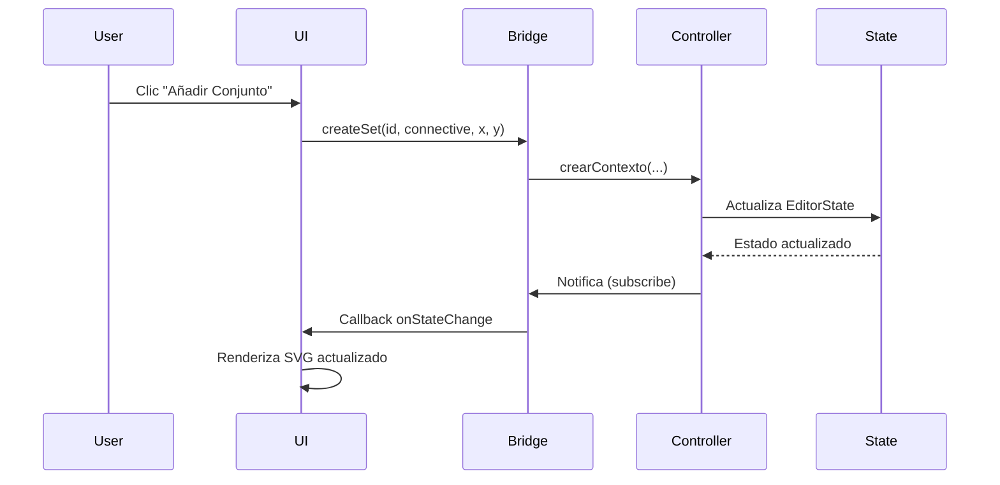
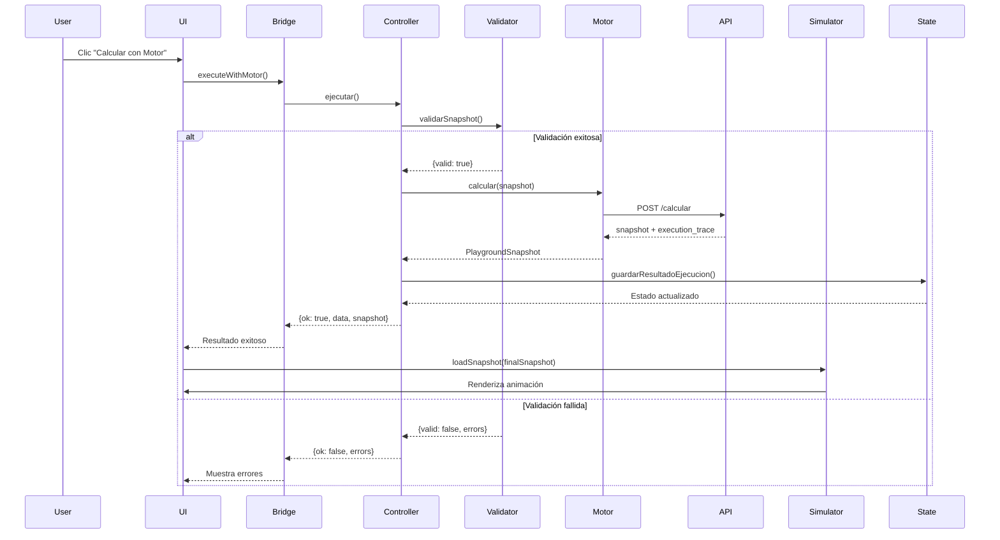

# 🔗 Integración Editor TypeScript + Simulador - Documentación Completa

## 📋 Resumen Ejecutivo

Este documento describe la integración completa del **EditorController de TypeScript** (equipo Editor) con el **Simulador JavaScript** (equipo Simulador) en una aplicación web unificada. La integración permite crear, editar y visualizar escenarios lógicos de propagación de Belnap con validación robusta y comunicación directa con el motor API.

**Fecha de Integración:** Mayo 2026  
**Versión:** 3.0  
**Estado:** ✅ Completado

---

## 🎯 Objetivos Alcanzados

✅ **Integración Completa**: Editor TypeScript y Simulador JavaScript funcionando en armonía  
✅ **Validación Robusta**: Uso de `validarSnapshot` antes de enviar al motor  
✅ **Cliente API Profesional**: `MotorApiClient` con manejo de errores  
✅ **Gestión de Estado**: `EditorController` con patrón Observer  
✅ **Separación de Responsabilidades**: Lógica (Editor) vs Visualización (Simulador)  
✅ **Compatibilidad Total**: Formatos de datos 100% compatibles  

---

## 📦 Archivos Modificados y Creados

### Archivos Nuevos

| Archivo | Descripción | Líneas |
|---------|-------------|--------|
| `epic_simulador/editor-bridge.js` | Módulo puente entre Editor y Simulador | 344 |
| `epic_simulador/INTEGRATION_README.md` | Este documento | - |

### Archivos Modificados

| Archivo | Cambios Principales |
|---------|---------------------|
| `tsconfig.json` | Configuración para compilar a ES modules |
| `epic_simulador/package.json` | Scripts de build y dependencias TypeScript |
| `epic_simulador/index.html` | Import del editor-bridge.js |
| `epic_simulador/simulator.js` | Integración con EditorBridge en todas las funciones del editor |

---

## 🏗️ Arquitectura de la Integración

```
┌─────────────────────────────────────────────────────────────┐
│                    Frontend Unificado                        │
│                      (index.html)                            │
├─────────────────────────────────────────────────────────────┤
│                                                               │
│  ┌──────────────────┐         ┌──────────────────┐          │
│  │  Tab: Editor     │         │  Tab: Simulador  │          │
│  │  Interactivo     │         │  (Animaciones)   │          │
│  └────────┬─────────┘         └────────┬─────────┘          │
│           │                            │                     │
│           └────────────┬───────────────┘                     │
│                        │                                     │
│              ┌─────────▼──────────┐                          │
│              │  editor-bridge.js  │                          │
│              │  (Módulo Puente)   │                          │
│              └─────────┬──────────┘                          │
│                        │                                     │
│         ┌──────────────┼──────────────┐                      │
│         │              │              │                      │
│    ┌────▼────┐   ┌────▼────┐   ┌────▼────┐                 │
│    │ Editor  │   │  Motor  │   │Simulator│                 │
│    │Controller│   │ApiClient│   │   JS    │                 │
│    │   (TS)  │   │   (TS)  │   │         │                 │
│    └─────────┘   └────┬────┘   └─────────┘                 │
│                       │                                      │
└───────────────────────┼──────────────────────────────────────┘
                        │
                        ▼
                ┌───────────────┐
                │  EPiC Motor   │
                │  (FastAPI)    │
                │ localhost:8000│
                └───────────────┘
```

---

## 🔧 Configuración del Sistema de Build

### 1. TypeScript Configuration (`tsconfig.json`)

```json
{
  "compilerOptions": {
    "target": "ESNext",
    "module": "ESNext",
    "moduleResolution": "bundler",
    "types": ["jest", "node"],
    "esModuleInterop": true,
    "strict": true,
    "skipLibCheck": true,
    "declaration": true,
    "outDir": "./epic_simulador/dist",
    "rootDir": "./epic_editor"
  },
  "include": ["epic_editor/**/*"],
  "exclude": ["node_modules", "epic_motor", "epic_simulador"]
}
```

**Cambios clave:**
- `module: "ESNext"` - Compilar a ES modules para Vite
- `outDir: "./epic_simulador/dist"` - Salida en carpeta del simulador
- `declaration: true` - Generar archivos .d.ts para tipos

### 2. Package.json del Simulador

```json
{
  "type": "module",
  "scripts": {
    "dev": "npm run build:editor && vite",
    "build": "npm run build:editor && vite build",
    "build:editor": "tsc --project ../tsconfig.json",
    "preview": "vite preview"
  },
  "devDependencies": {
    "vite": "^5.0.0",
    "typescript": "^5.3.0"
  }
}
```

**Cambios clave:**
- `"type": "module"` - Habilitar ES modules
- `build:editor` - Script para compilar TypeScript
- Dependencia de TypeScript agregada

---

## 🌉 El Módulo Puente (editor-bridge.js)

### Responsabilidades

El `editor-bridge.js` actúa como intermediario entre el Editor TypeScript y el Simulador JavaScript:

1. **Inicialización**: Crea instancias de `EditorController` y `MotorApiClient`
2. **Gestión de Estado**: Suscripción a cambios del editor
3. **API Simplificada**: Expone funciones fáciles de usar para el simulador
4. **Validación**: Integra `validarSnapshot` antes de ejecutar
5. **Manejo de Errores**: Callbacks para errores y notificaciones

### API Pública del Bridge

#### Inicialización

```javascript
import * as EditorBridge from './editor-bridge.js';

// Inicializar el bridge
EditorBridge.initializeEditorBridge('http://localhost:8000');

// Registrar callbacks
EditorBridge.onStateChange((snapshot) => {
  // Actualizar vista cuando cambie el estado
  renderEditorPreview(snapshot);
});

EditorBridge.onError((errors) => {
  // Manejar errores
  displayErrors(errors);
});
```

#### Gestión de Conjuntos

```javascript
// Crear conjunto
const result = EditorBridge.createSet(
  'set_A',           // id
  'PROPAGATION',     // connective
  150,               // x
  200,               // y
  65                 // radius
);

// Eliminar conjunto
EditorBridge.deleteSet('set_A');
```

#### Gestión de Variables

```javascript
// Crear variable lógica
EditorBridge.createVariable('p', 'V');

// Crear instancia visual
EditorBridge.createVariableInstance(
  'inst_p',  // instance_id
  'p',       // variable_id
  150,       // x
  200        // y
);

// Eliminar variable
EditorBridge.deleteVariable('p');
```

#### Gestión de Relaciones

```javascript
// Crear relación
EditorBridge.createRelation(
  'rel1',           // id
  'p',              // from_variable
  'q',              // to_variable
  'PROPAGATION'     // connective
);
```

#### Validación y Ejecución

```javascript
// Validar snapshot
const validation = EditorBridge.validateSnapshot();
if (!validation.valid) {
  console.error('Errores:', validation.errors);
}

// Ejecutar con el motor
const result = await EditorBridge.executeWithMotor();
if (result.ok) {
  const snapshot = result.snapshot;
  const trace = result.data;
  // Cargar en simulador
  loadSnapshot(snapshot);
}
```

#### Utilidades

```javascript
// Obtener estado actual
const state = EditorBridge.getEditorState();

// Obtener snapshot actual
const snapshot = EditorBridge.getCurrentSnapshot();

// Reiniciar editor
EditorBridge.resetEditor();

// Verificar inicialización
const isReady = EditorBridge.isInitialized();

// Debug info
const debug = EditorBridge.getDebugInfo();
```

---

## 🔄 Flujo de Datos Completo

### Creación de un Escenario



### Cálculo con el Motor



---

## 📝 Cambios en el Simulador (simulator.js)

### 1. Imports del Bridge

```javascript
// Al inicio del archivo
import * as EditorBridge from './editor-bridge.js';
```

### 2. Inicialización

```javascript
document.addEventListener("DOMContentLoaded", async () => {
  lucide.createIcons();
  
  // Inicializar el Editor Bridge
  EditorBridge.initializeEditorBridge('http://localhost:8000');
  
  // Registrar callbacks
  EditorBridge.onStateChange((snapshot) => {
    renderEditorPreview();
  });
  
  EditorBridge.onError((errors) => {
    displayEditorErrors(errors);
  });
  
  setupEventListeners();
  setupEditorEventListeners();
  loadSnapshot(PRESETS.simple);
});
```

### 3. Funciones del Editor Reemplazadas

#### resetEditorGraph()

```javascript
function resetEditorGraph() {
  // Reiniciar el bridge (crea nuevo EditorController)
  EditorBridge.resetEditor();
  
  // Limpiar editorGraph local (compatibilidad)
  editorGraph = {
    sets: {},
    instances: {},
    relations: {},
    logic: { variables: [], sets: [], relations: [] }
  };
  
  syncEditorDropdowns();
  renderEditorPreview();
  document.getElementById("apiErrorLog").style.display = "none";
}
```

#### editorAddSet()

```javascript
function editorAddSet() {
  const id = document.getElementById("editSetName").value.trim();
  const connective = document.getElementById("editSetConnective").value;
  
  // Calcular posición
  const state = EditorBridge.getEditorState();
  const count = state.snapshot.logic.sets.length;
  const x = 120 + count * 220;
  const y = 150;
  
  // Usar el bridge
  const result = EditorBridge.createSet(id, connective, x, y, 65);
  
  if (!result.ok) {
    alert(result.errors[0].message);
    return;
  }
  
  // Actualizar editorGraph local (compatibilidad)
  editorGraph.logic.sets.push({...});
  editorGraph.sets[id] = {...};
  
  syncEditorDropdowns();
  renderEditorPreview();
}
```

#### editorAddVariable()

```javascript
function editorAddVariable() {
  const id = document.getElementById("editVarName").value.trim();
  const setId = document.getElementById("editVarSet").value;
  const val = document.getElementById("editVarVal").value;
  
  // Crear variable lógica
  const varResult = EditorBridge.createVariable(id, val);
  if (!varResult.ok) {
    alert(varResult.errors[0].message);
    return;
  }
  
  // Calcular posición visual
  const parentSet = editorGraph.sets[setId];
  const x = parentSet.x + dx;
  const y = parentSet.y + dy;
  
  // Crear instancia visual
  const instId = `inst_${id}`;
  const instResult = EditorBridge.createVariableInstance(instId, id, x, y);
  
  if (!instResult.ok) {
    alert(instResult.errors[0].message);
    return;
  }
  
  // Actualizar editorGraph local
  editorGraph.logic.variables.push({...});
  editorGraph.instances[instId] = {...};
  
  syncEditorDropdowns();
  renderEditorPreview();
}
```

#### editorAddRelation()

```javascript
function editorAddRelation() {
  const fromVar = document.getElementById("editRelFrom").value;
  const toVar = document.getElementById("editRelTo").value;
  const connective = document.getElementById("editRelConnective").value;
  
  const id = `rel_${fromVar}_to_${toVar}`;
  
  // Crear relación usando el bridge
  const result = EditorBridge.createRelation(id, fromVar, toVar, connective);
  
  if (!result.ok) {
    alert(result.errors[0].message);
    return;
  }
  
  // Actualizar editorGraph local
  editorGraph.logic.relations.push({...});
  editorGraph.relations[id] = {...};
  
  renderEditorPreview();
}
```

#### calculateWithAPI() - ⭐ Función Principal

```javascript
async function calculateWithAPI() {
  const errorLog = document.getElementById("apiErrorLog");
  errorLog.style.display = "none";
  
  // Verificar inicialización
  if (!EditorBridge.isInitialized()) {
    errorLog.innerHTML = "Error: Bridge no inicializado";
    return;
  }
  
  const state = EditorBridge.getEditorState();
  if (state.snapshot.logic.variables.length === 0) {
    alert("Añade al menos una variable");
    return;
  }
  
  // Validar snapshot
  const validation = EditorBridge.validateSnapshot();
  if (!validation.valid) {
    errorLog.style.display = "block";
    errorLog.innerHTML = "<strong>Errores de Validación:</strong><ul>";
    validation.errors.forEach(err => {
      errorLog.innerHTML += `<li>${err.field}: ${err.message}</li>`;
    });
    errorLog.innerHTML += "</ul>";
    return;
  }
  
  try {
    // Ejecutar con el motor
    const result = await EditorBridge.executeWithMotor();
    
    if (!result.ok) {
      // Mostrar errores
      errorLog.style.display = "block";
      errorLog.innerHTML = "<strong>Error:</strong><ul>";
      result.errors.forEach(err => {
        errorLog.innerHTML += `<li>${err.field}: ${err.message}</li>`;
      });
      errorLog.innerHTML += "</ul>";
      return;
    }
    
    // Cargar snapshot con traza
    const finalSnapshot = result.snapshot;
    loadSnapshot(finalSnapshot);
    
    // Cambiar a vista de cajitas
    document.querySelectorAll(".tab-btn").forEach(btn => {
      if (btn.getAttribute("data-tab") === "box-view") {
        btn.click();
      }
    });
    
    alert("¡Éxito! Propagación calculada. Reproduciendo animación.");
    
  } catch (err) {
    errorLog.style.display = "block";
    errorLog.innerHTML = `<strong>Error:</strong> ${err.message}`;
  }
}
```

---

## 🚀 Guía de Instalación y Uso

### Requisitos Previos

- **Node.js** 18 o superior
- **Python** 3.10 o superior
- **npm** (incluido con Node.js)
- **pip** (incluido con Python)

### Paso 1: Instalar Dependencias

```bash
# En la raíz del proyecto
cd Super-Equipo-DSD

# Instalar dependencias del simulador
cd epic_simulador
npm install

# Volver a la raíz
cd ..
```

### Paso 2: Compilar el Editor TypeScript

```bash
# Desde epic_simulador
npm run build:editor
```

Esto compilará el código TypeScript del editor y generará los archivos en `epic_simulador/dist/`.

**Estructura generada:**
```
epic_simulador/dist/
├── controllers/
│   ├── editorController.js
│   └── editorController.d.ts
├── domain/
│   ├── editorActions.js
│   ├── editorState.js
│   ├── editorTypes.js
│   └── *.d.ts
├── services/
│   ├── motorApiClient.js
│   └── motorApiClient.d.ts
└── validators/
    ├── editorValidation.js
    └── editorValidation.d.ts
```

### Paso 3: Iniciar el Motor API

```bash
# En una terminal separada
cd epic_motor

# Instalar dependencias (primera vez)
pip install -r requirements.txt

# Iniciar el servidor
python -m uvicorn main:app --reload --port 8000
```

El motor debe estar corriendo en `http://localhost:8000`.

### Paso 4: Iniciar el Simulador

```bash
# En otra terminal
cd epic_simulador

# Iniciar servidor de desarrollo
npm run dev
```

Vite mostrará la URL local (típicamente `http://localhost:5173/`).

### Paso 5: Usar la Aplicación

1. **Abrir el navegador** en `http://localhost:5173/`
2. **Ir a la pestaña "Editor Interactivo"**
3. **Crear un escenario:**
   - Añadir conjuntos (sets)
   - Añadir variables con valores de verdad
   - Crear relaciones (implicaciones)
4. **Calcular con el Motor:**
   - Clic en "⚡ Calcular con el Motor API"
   - El sistema validará el snapshot
   - Enviará al motor para calcular la propagación
   - Mostrará la animación en la vista de cajitas

---

## 🧪 Guía de Pruebas

### Prueba 1: Implicación Simple

**Objetivo:** Verificar propagación básica V → N

1. Crear conjunto `set_A` con conectivo `PROPAGATION`
2. Crear conjunto `set_B` con conectivo `PROPAGATION`
3. Crear variable `p` en `set_A` con valor `V` (Verde)
4. Crear variable `q` en `set_B` con valor `N` (Neutro)
5. Crear relación de `p` a `q` con conectivo `PROPAGATION`
6. Calcular con el motor
7. **Resultado esperado:** `q` debe cambiar a `V`

### Prueba 2: Contrapositiva (Modus Tollens)

**Objetivo:** Verificar propagación contraposicional F ← F

1. Crear conjunto `set_A` con conectivo `CONTRAPOSITIONAL`
2. Crear conjunto `set_B` con conectivo `CONTRAPOSITIONAL`
3. Crear variable `p` en `set_A` con valor `N` (Neutro)
4. Crear variable `q` en `set_B` con valor `F` (Falso)
5. Crear relación de `p` a `q` con conectivo `CONTRAPOSITIONAL`
6. Calcular con el motor
7. **Resultado esperado:** `p` debe cambiar a `F` (Modus Tollens)

### Prueba 3: Contradicción

**Objetivo:** Verificar detección de contradicción (V y F → B)

1. Crear tres conjuntos: `set_A`, `set_B`, `set_C`
2. Crear variable `p1` en `set_A` con valor `V`
3. Crear variable `p2` en `set_B` con valor `F`
4. Crear variable `q` en `set_C` con valor `N`
5. Crear relación de `p1` a `q` con `PROPAGATION`
6. Crear relación de `p2` a `q` con `PROPAGATION`
7. Calcular con el motor
8. **Resultado esperado:** `q` debe cambiar a `B` (Ambos/Contradicción)

### Prueba 4: Validación de Errores

**Objetivo:** Verificar que la validación funciona correctamente

1. Intentar crear una variable sin conjunto contenedor
2. **Resultado esperado:** Error de validación
3. Intentar crear una relación de una variable a sí misma
4. **Resultado esperado:** Error de validación
5. Intentar calcular sin variables
6. **Resultado esperado:** Alerta "Añade al menos una variable"

### Prueba 5: Ciclo Retroalimentado

**Objetivo:** Verificar propagación en ciclos

1. Crear tres conjuntos: `set_A`, `set_B`, `set_C`
2. Crear variable `p` en `set_A` con valor `V`
3. Crear variable `q` en `set_B` con valor `N`
4. Crear variable `r` en `set_C` con valor `N`
5. Crear relación `p → q`
6. Crear relación `q → r`
7. Crear relación `r → p`
8. Calcular con el motor
9. **Resultado esperado:** Sistema se estabiliza con todas las variables en `V`

---

## 🐛 Solución de Problemas Comunes

### Error: "Bridge no inicializado"

**Causa:** El editor-bridge.js no se cargó correctamente.

**Solución:**
1. Verificar que `editor-bridge.js` existe en `epic_simulador/`
2. Verificar que el import está en `index.html`
3. Recargar la página (Ctrl+F5)
4. Revisar la consola del navegador para errores

### Error: "Cannot find module '../epic_editor/dist/...'"

**Causa:** El código TypeScript no se compiló.

**Solución:**
```bash
cd epic_simulador
npm run build:editor
```

Verificar que se creó la carpeta `epic_simulador/dist/`.

### Error: "Motor respondió con estado 500"

**Causa:** Error interno del motor API.

**Solución:**
1. Verificar que el motor está corriendo: `http://localhost:8000/docs`
2. Revisar logs del motor en la terminal
3. Verificar que el snapshot es válido
4. Reiniciar el motor si es necesario

### Error: "No se pudo conectar con el Motor"

**Causa:** El motor API no está corriendo.

**Solución:**
```bash
cd epic_motor
python -m uvicorn api.app:app --reload --port 8000
```

Verificar que responde en `http://localhost:8000/health`.

### Error de Validación: "Variable no encontrada"

**Causa:** Referencia a una variable que no existe.

**Solución:**
1. Verificar que todas las variables referenciadas en relaciones existen
2. Verificar que los IDs son correctos (case-sensitive)
3. Usar el botón "Limpiar Todo" y recrear el escenario

### La animación no se reproduce

**Causa:** El snapshot no tiene `execution_trace`.

**Solución:**
1. Verificar que el cálculo con el motor fue exitoso
2. Revisar la consola del navegador
3. Verificar que el motor devolvió una traza válida
4. Intentar con un ejemplo preset primero

---

## 📊 Comparación: Antes vs Después

### Antes de la Integración

| Aspecto | Estado |
|---------|--------|
| Validación | ❌ Ninguna |
| Gestión de Estado | ❌ Objeto plano `editorGraph` |
| Cliente API | ❌ Fetch directo sin manejo de errores |
| Tipado | ❌ JavaScript sin tipos |
| Arquitectura | ❌ Código acoplado |
| Reutilización | ❌ Código específico del simulador |

### Después de la Integración

| Aspecto | Estado |
|---------|--------|
| Validación | ✅ `validarSnapshot` integrado |
| Gestión de Estado | ✅ `EditorController` con patrón Observer |
| Cliente API | ✅ `MotorApiClient` robusto |
| Tipado | ✅ TypeScript con tipos fuertes |
| Arquitectura | ✅ Separación clara de responsabilidades |
| Reutilización | ✅ EditorController reutilizable |

---

## 🎓 Conceptos Clave

### Patrón Observer

El `EditorController` implementa el patrón Observer:

```javascript
// Suscribirse a cambios
controller.subscribe((state) => {
  console.log('Estado actualizado:', state);
  renderUI(state.snapshot);
});

// Cuando el estado cambia, todos los suscriptores son notificados
controller.crearVariable('p', 'V');
// → Notifica a todos los suscriptores
```

### Separación de Responsabilidades

```
┌─────────────────────────────────────┐
│         EditorController            │
│  (Lógica de negocio y estado)       │
└──────────────┬──────────────────────┘
               │
               │ Notifica cambios
               │
┌──────────────▼──────────────────────┐
│         editor-bridge.js            │
│  (Adaptador y orquestación)         │
└──────────────┬──────────────────────┘
               │
               │ Actualiza vista
               │
┌──────────────▼──────────────────────┐
│         simulator.js                │
│  (Renderizado y visualización)      │
└─────────────────────────────────────┘
```

### Validación en Capas

1. **Validación de UI**: Campos requeridos, formatos básicos
2. **Validación del Bridge**: Verificar que el bridge está inicializado
3. **Validación del Controller**: `validarSnapshot` completo
4. **Validación del Motor**: Validación final en el backend

---

## 📚 Referencias y Recursos

### Documentación del Editor

- `epic_editor/index.ts` - Exportaciones principales
- `epic_editor/domain/editorTypes.ts` - Definiciones de tipos
- `epic_editor/controllers/editorController.ts` - Controlador principal
- `epic_editor/services/motorApiClient.ts` - Cliente del motor
- `epic_editor/validators/editorValidation.ts` - Validador de snapshots

### Documentación del Simulador

- `epic_simulador/README.md` - Documentación original del simulador
- `epic_simulador/simulator.js` - Lógica del simulador
- `epic_simulador/style.css` - Estilos y animaciones

### Documentación del Motor

- `epic_motor/READ_ME.txt` - Documentación del motor
- `epic_motor/api/routes.py` - Endpoints de la API
- `http://localhost:8000/docs` - Documentación interactiva (Swagger)

---

## 🔮 Próximos Pasos y Mejoras Futuras

### Funcionalidades Pendientes

- [ ] **Drag & Drop**: Mover conjuntos y variables arrastrando
- [ ] **Undo/Redo**: Historial de acciones
- [ ] **Exportar/Importar**: Guardar y cargar escenarios
- [ ] **Temas**: Modo claro/oscuro
- [ ] **Atajos de Teclado**: Acciones rápidas

### Optimizaciones

- [ ] **Lazy Loading**: Cargar módulos bajo demanda
- [ ] **Memoización**: Cachear resultados de validación
- [ ] **Web Workers**: Cálculos pesados en background
- [ ] **Service Worker**: Funcionalidad offline

### Extensiones

- [ ] **Múltiples Motores**: Soporte para diferentes backends
- [ ] **Plugins**: Sistema de extensiones
- [ ] **Colaboración**: Edición multi-usuario
- [ ] **Análisis**: Estadísticas de uso

---

## 👥 Créditos

### Equipo Editor
- Desarrollo del `EditorController`
- Implementación de tipos TypeScript
- Cliente del Motor API
- Validador de snapshots

### Equipo Simulador
- Interfaz visual interactiva
- Motor de renderizado SVG
- Sistema de animaciones
- Visualización de trazas

### Equipo Motor
- Backend FastAPI
- Lógica de propagación de Belnap
- API REST
- Cálculo de inferencias

### Integración
- Módulo puente `editor-bridge.js`
- Configuración del sistema de build
- Documentación completa
- Pruebas de integración

---

## 📄 Licencia

Este proyecto es parte del curso de Diseño de Sistemas Digitales (DSD) en ESCOM-IPN.

---

## 📞 Soporte

Para problemas o preguntas:

1. **Revisar este README** - La mayoría de problemas están documentados
2. **Consola del Navegador** - Revisar errores en DevTools (F12)
3. **Logs del Motor** - Revisar la terminal donde corre el motor
4. **GitHub Issues** - Reportar bugs o solicitar features

---

**Última actualización:** Mayo 2026  
**Versión del documento:** 1.0  
**Estado:** ✅ Integración Completa y Funcional