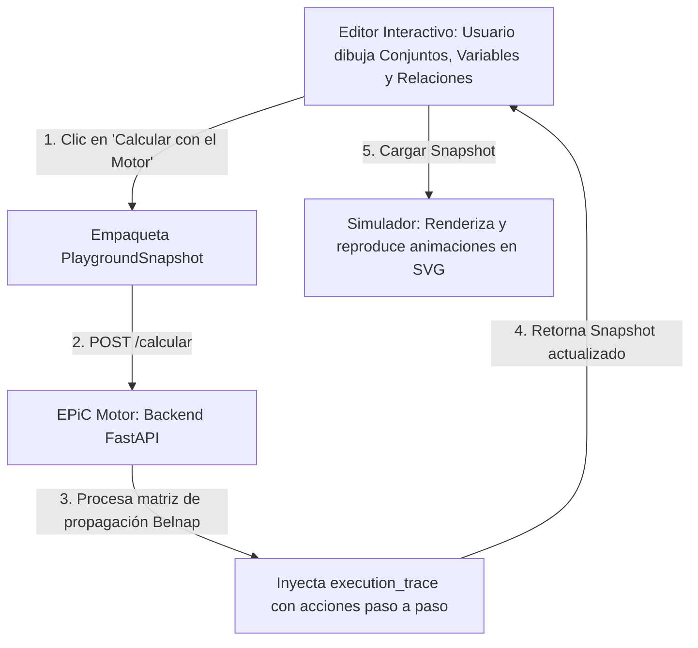

# EPiC Playground - Simulador y Editor Interactivo

Este directorio contiene la interfaz web visual (Frontend) de **EPiC Playground**. Está diseñado con un enfoque moderno y dinámico para que los usuarios puedan interactuar con la lógica de Belnap de cuatro valores ($V, F, N, B$), dibujar conjuntos, variables y relaciones de implicación, y visualizar paso a paso la propagación calculada por el motor.

---

## 📐 Arquitectura y Flujo de Datos

El diseño de esta rama separa estrictamente la **lógica matemática** de las **coordenadas visuales**, permitiendo que una misma variable lógica (ej. `p`) esté dibujada en múltiples cajas o sets a la vez y actúe de forma sincronizada.



### Componentes Clave:
1. **EPiC Motor (`epic_motor/`)**: Backend en Python (FastAPI) que calcula la inferencia lógica.
2. **EPiC Simulador (`epic_simulador/`)**: SPA interactiva (Vite + HTML/CSS/JS vanila) con soporte para:
   * **Vista de Cajitas (Pares)**: Muestra conjuntos agrupados en pares consecutivos de implicación.
   * **Vista Global**: Un lienzo interactivo con zoom, paneo y distribución automática del grafo.
   * **Editor Interactivo (Sandbox)**: Espacio de dibujo para crear y probar escenarios desde el navegador.

---

## 🛠️ Requisitos previos

Asegúrate de tener instalado en tu máquina:
* **Node.js** (versión 18 o superior)
* **Python** (versión 3.10 o superior)
* **Gestores de paquetes**: `npm` (incluido con Node) y `pip` (incluido con Python)

---

## 🚀 Guía de Instalación y Despliegue Local

Para levantar todo el sistema de manera local, abre tu terminal y sigue los siguientes pasos:

### 1. Configurar y encender el Backend (EPiC Motor)

Navega a la carpeta del motor, instala las dependencias necesarias y arranca el servidor FastAPI:

```bash
# 1. Entrar a la carpeta del motor
cd epic_motor

# 2. Instalar dependencias de Python
pip install -r requirements.txt

# 3. Iniciar el servidor local en el puerto 8000
python -m uvicorn main:app --reload --port 8000
```
> [!IMPORTANT]
> El motor debe quedar corriendo en `http://localhost:8000`. No cierres esta ventana de la terminal.

---

### 2. Configurar y encender el Frontend (EPiC Simulador)

En una **nueva pestaña o ventana de la terminal**, navega a la carpeta del simulador y enciende el servidor de desarrollo de Vite:

```bash
# 1. Entrar a la carpeta del simulador
cd epic_simulador

# 2. Instalar las dependencias de Node
npm install

# 3. Arrancar el servidor de desarrollo local
npm run dev
```

Una vez que termine de compilar (en menos de 100 ms), la terminal te indicará la URL local:
👉 **`http://localhost:5173/`**

Ábrela en tu navegador para ver la interfaz interactiva.

---

## 🎨 Cómo funciona la Simulación y Animación Paso a Paso

### 1. El Editor Interactivo (Sandbox)
En la pestaña **"Editor Interactivo"** puedes dibujar tu propio escenario lógico desde cero:
* **Crear Conjuntos**: Define conjuntos lógicos (como `set_A`, `set_B`) y su conectivo principal.
* **Crear Variables**: Añade variables (ej. `p`, `q`) asignándoles un conjunto contenedor y un valor de verdad inicial.
  * **Consejo**: Deja las variables de destino en **`N` (Neutro)** para que empiecen invisibles y puedas ver cómo les llega la animación.
* **Crear Relaciones (Implicaciones)**: Selecciona una variable origen, una de destino y el conectivo.
* **Calcular con el Motor API**: Envía tu diseño al Backend Python para calcular la propagación de forma inmediata.

### 2. Animación Inteligente de Partículas
Cuando el simulador recibe la traza del motor (`execution_trace`), crea una línea de tiempo paso a paso:
* **Valores Positivos (`V`)**: Viajan en dirección de la flecha (hacia adelante). Se representan con partículas verdes.
* **Valores Negativos (`F`)**: Viajan en dirección contraria a la flecha (hacia atrás / contrapositiva). Se representan con partículas rojas.
* **Visibilidad Dinámica (History-Aware)**: Las variables de destino con valor inicial `N` (neutras) comienzan invisibles en el paso 0. La bolita de verdad correspondiente aparecerá mágicamente en su circunferencia de destino una vez que la animación de la partícula complete su recorrido.

### 3. Controles de Reproducción
En la barra de herramientas superior tienes control absoluto de la simulación:
* **Play / Pause**: Reproduce o pausa la animación cronometrada.
* **Step Forward (Siguiente paso) / Step Backward (Paso anterior)**: Permite depurar la propagación cuadro por cuadro manualmente.
* **Velocidad (Slider)**: Cambia dinámicamente el tiempo de transición (entre 300ms y 2500ms).

---

## 📂 Estructura del Simulador (`epic_simulador/`)

* **`index.html`**: Estructura principal y layout de pestañas de la aplicación.
* **`style.css`**: Sistema de diseño moderno. Contiene variables HSL para el modo oscuro, estilo glassmorphism y las animaciones/keyframes de flujo CSS.
* **`simulator.js`**: El motor del simulador gráfico. Administra el estado de la reproducción, dibuja los elementos SVG y gestiona la comunicación HTTP con el microservicio del motor lógico.
* **`e2e-real-trace.json`**: Un archivo JSON de ejemplo de prueba que puedes arrastrar o copiar para ver un flujo complejo en acción de inmediato.

---

## ⚡ Comandos Útiles en `epic_simulador`

* `npm run dev`: Arranca el servidor local de desarrollo.
* `npm run build`: Empaqueta y optimiza los archivos para producción dentro de la carpeta `dist/`.
* `npm run preview`: Previsualiza localmente el build de producción generado.
